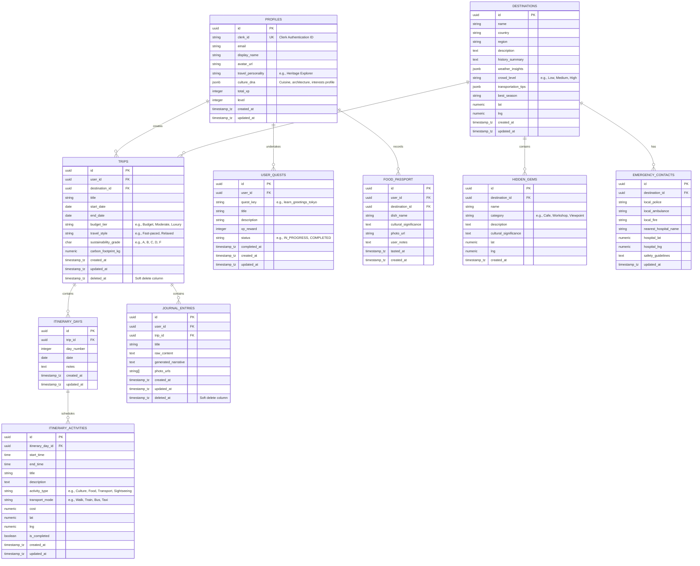

# Database Schema Design - Culture Compass AI

This document details the production-ready PostgreSQL (Supabase compatible) schema, indexes, constraints, audit triggers, and row-level security (RLS) policies.

---

## 1. Entity Relationship Diagram (ERD)



---

## 2. SQL DDL Statements

Below is the production-ready PostgreSQL DDL including schemas, extensions, tables, indices, and audit triggers.

```sql
-- Enable necessary extensions
CREATE EXTENSION IF NOT EXISTS "uuid-ossp";

-- 2.1 Profiles Table
CREATE TABLE profiles (
    id UUID PRIMARY KEY DEFAULT uuid_generate_v4(),
    clerk_id VARCHAR(255) UNIQUE NOT NULL,
    email VARCHAR(255) NOT NULL,
    display_name VARCHAR(100),
    avatar_url TEXT,
    travel_personality VARCHAR(50),
    culture_dna JSONB DEFAULT '{}'::jsonb,
    total_xp INTEGER DEFAULT 0 NOT NULL,
    level INTEGER DEFAULT 1 NOT NULL,
    created_at TIMESTAMP WITH TIME ZONE DEFAULT timezone('utc'::text, now()) NOT NULL,
    updated_at TIMESTAMP WITH TIME ZONE DEFAULT timezone('utc'::text, now()) NOT NULL
);

-- 2.2 Destinations Table
CREATE TABLE destinations (
    id UUID PRIMARY KEY DEFAULT uuid_generate_v4(),
    name VARCHAR(100) NOT NULL,
    country VARCHAR(100) NOT NULL,
    region VARCHAR(100),
    description TEXT NOT NULL,
    history_summary TEXT,
    weather_insights JSONB DEFAULT '{}'::jsonb,
    crowd_level VARCHAR(20) DEFAULT 'Medium',
    transportation_tips JSONB DEFAULT '{}'::jsonb,
    best_season VARCHAR(50),
    lat NUMERIC(10, 7) NOT NULL,
    lng NUMERIC(10, 7) NOT NULL,
    created_at TIMESTAMP WITH TIME ZONE DEFAULT timezone('utc'::text, now()) NOT NULL,
    updated_at TIMESTAMP WITH TIME ZONE DEFAULT timezone('utc'::text, now()) NOT NULL,
    CONSTRAINT chk_lat CHECK (lat BETWEEN -90 AND 90),
    CONSTRAINT chk_lng CHECK (lng BETWEEN -180 AND 180)
);

-- 2.3 Hidden Gems Table
CREATE TABLE hidden_gems (
    id UUID PRIMARY KEY DEFAULT uuid_generate_v4(),
    destination_id UUID NOT NULL REFERENCES destinations(id) ON DELETE CASCADE,
    name VARCHAR(150) NOT NULL,
    category VARCHAR(50) NOT NULL,
    description TEXT NOT NULL,
    cultural_significance TEXT NOT NULL,
    lat NUMERIC(10, 7) NOT NULL,
    lng NUMERIC(10, 7) NOT NULL,
    created_at TIMESTAMP WITH TIME ZONE DEFAULT timezone('utc'::text, now()) NOT NULL,
    CONSTRAINT chk_gem_lat CHECK (lat BETWEEN -90 AND 90),
    CONSTRAINT chk_gem_lng CHECK (lng BETWEEN -180 AND 180)
);

-- 2.4 Trips Table (Soft Delete enabled)
CREATE TABLE trips (
    id UUID PRIMARY KEY DEFAULT uuid_generate_v4(),
    user_id UUID NOT NULL REFERENCES profiles(id) ON DELETE CASCADE,
    destination_id UUID NOT NULL REFERENCES destinations(id) ON DELETE RESTRICT,
    title VARCHAR(150) NOT NULL,
    start_date DATE NOT NULL,
    end_date DATE NOT NULL,
    budget_tier VARCHAR(20) DEFAULT 'Moderate' NOT NULL,
    travel_style VARCHAR(30) DEFAULT 'Relaxed' NOT NULL,
    sustainability_grade CHAR(1) DEFAULT 'C' NOT NULL,
    carbon_footprint_kg NUMERIC(10, 2) DEFAULT 0.00 NOT NULL,
    created_at TIMESTAMP WITH TIME ZONE DEFAULT timezone('utc'::text, now()) NOT NULL,
    updated_at TIMESTAMP WITH TIME ZONE DEFAULT timezone('utc'::text, now()) NOT NULL,
    deleted_at TIMESTAMP WITH TIME ZONE,
    CONSTRAINT chk_dates CHECK (start_date <= end_date)
);

-- 2.5 Itinerary Days Table
CREATE TABLE itinerary_days (
    id UUID PRIMARY KEY DEFAULT uuid_generate_v4(),
    trip_id UUID NOT NULL REFERENCES trips(id) ON DELETE CASCADE,
    day_number INTEGER NOT NULL,
    date DATE NOT NULL,
    notes TEXT,
    created_at TIMESTAMP WITH TIME ZONE DEFAULT timezone('utc'::text, now()) NOT NULL,
    updated_at TIMESTAMP WITH TIME ZONE DEFAULT timezone('utc'::text, now()) NOT NULL,
    CONSTRAINT unique_trip_day UNIQUE (trip_id, day_number)
);

-- 2.6 Itinerary Activities Table
CREATE TABLE itinerary_activities (
    id UUID PRIMARY KEY DEFAULT uuid_generate_v4(),
    itinerary_day_id UUID NOT NULL REFERENCES itinerary_days(id) ON DELETE CASCADE,
    start_time TIME NOT NULL,
    end_time TIME NOT NULL,
    title VARCHAR(150) NOT NULL,
    description TEXT,
    activity_type VARCHAR(50) DEFAULT 'Sightseeing' NOT NULL,
    transport_mode VARCHAR(50) DEFAULT 'Walk',
    cost NUMERIC(10, 2) DEFAULT 0.00,
    lat NUMERIC(10, 7),
    lng NUMERIC(10, 7),
    is_completed BOOLEAN DEFAULT FALSE NOT NULL,
    created_at TIMESTAMP WITH TIME ZONE DEFAULT timezone('utc'::text, now()) NOT NULL,
    updated_at TIMESTAMP WITH TIME ZONE DEFAULT timezone('utc'::text, now()) NOT NULL,
    CONSTRAINT chk_times CHECK (start_time <= end_time)
);

-- 2.7 User Quests Table
CREATE TABLE user_quests (
    id UUID PRIMARY KEY DEFAULT uuid_generate_v4(),
    user_id UUID NOT NULL REFERENCES profiles(id) ON DELETE CASCADE,
    quest_key VARCHAR(100) NOT NULL,
    title VARCHAR(150) NOT NULL,
    description TEXT NOT NULL,
    xp_reward INTEGER DEFAULT 50 NOT NULL,
    status VARCHAR(20) DEFAULT 'IN_PROGRESS' NOT NULL,
    completed_at TIMESTAMP WITH TIME ZONE,
    created_at TIMESTAMP WITH TIME ZONE DEFAULT timezone('utc'::text, now()) NOT NULL,
    updated_at TIMESTAMP WITH TIME ZONE DEFAULT timezone('utc'::text, now()) NOT NULL,
    CONSTRAINT unique_user_quest UNIQUE (user_id, quest_key)
);

-- 2.8 Food Passport Table
CREATE TABLE food_passport (
    id UUID PRIMARY KEY DEFAULT uuid_generate_v4(),
    user_id UUID NOT NULL REFERENCES profiles(id) ON DELETE CASCADE,
    destination_id UUID NOT NULL REFERENCES destinations(id) ON DELETE CASCADE,
    dish_name VARCHAR(100) NOT NULL,
    cultural_significance TEXT NOT NULL,
    photo_url TEXT,
    user_notes TEXT,
    tasted_at TIMESTAMP WITH TIME ZONE DEFAULT timezone('utc'::text, now()) NOT NULL,
    created_at TIMESTAMP WITH TIME ZONE DEFAULT timezone('utc'::text, now()) NOT NULL
);

-- 2.9 Journal Entries Table (Soft Delete enabled)
CREATE TABLE journal_entries (
    id UUID PRIMARY KEY DEFAULT uuid_generate_v4(),
    user_id UUID NOT NULL REFERENCES profiles(id) ON DELETE CASCADE,
    trip_id UUID REFERENCES trips(id) ON DELETE SET NULL,
    title VARCHAR(150) NOT NULL,
    raw_content TEXT NOT NULL,
    generated_narrative TEXT,
    photo_urls TEXT[] DEFAULT '{}'::text[] NOT NULL,
    created_at TIMESTAMP WITH TIME ZONE DEFAULT timezone('utc'::text, now()) NOT NULL,
    updated_at TIMESTAMP WITH TIME ZONE DEFAULT timezone('utc'::text, now()) NOT NULL,
    deleted_at TIMESTAMP WITH TIME ZONE
);

-- 2.10 Emergency Contacts Table
CREATE TABLE emergency_contacts (
    id UUID PRIMARY KEY DEFAULT uuid_generate_v4(),
    destination_id UUID NOT NULL UNIQUE REFERENCES destinations(id) ON DELETE CASCADE,
    local_police VARCHAR(20) DEFAULT '112' NOT NULL,
    local_ambulance VARCHAR(20) DEFAULT '112' NOT NULL,
    local_fire VARCHAR(20) DEFAULT '112' NOT NULL,
    nearest_hospital_name VARCHAR(150) NOT NULL,
    hospital_lat NUMERIC(10, 7) NOT NULL,
    hospital_lng NUMERIC(10, 7) NOT NULL,
    safety_guidelines TEXT,
    updated_at TIMESTAMP WITH TIME ZONE DEFAULT timezone('utc'::text, now()) NOT NULL
);
```

---

## 3. Database Indexes

To optimize performance and fast retrievals, we create dedicated indices, including composite indexes for query filters.

```sql
-- Indexes for profiles & lookups
CREATE INDEX idx_profiles_clerk_id ON profiles (clerk_id);

-- Destination search optimizations
CREATE INDEX idx_destinations_name_country ON destinations (name, country);

-- Geographic coordinate indices (B-tree on lat/lng range lookups)
CREATE INDEX idx_hidden_gems_coords ON hidden_gems (lat, lng);
CREATE INDEX idx_itinerary_activities_coords ON itinerary_activities (lat, lng);

-- Soft delete indices (Excludes soft-deleted rows from indexes to keep them compact)
CREATE INDEX idx_trips_active_user ON trips (user_id) WHERE deleted_at IS NULL;
CREATE INDEX idx_journal_entries_active_user ON journal_entries (user_id) WHERE deleted_at IS NULL;

-- Relationship indexes to speed up Joins
CREATE INDEX idx_hidden_gems_dest ON hidden_gems (destination_id);
CREATE INDEX idx_trips_dest ON trips (destination_id);
CREATE INDEX idx_itinerary_days_trip ON itinerary_days (trip_id);
CREATE INDEX idx_itinerary_activities_day ON itinerary_activities (itinerary_day_id);
CREATE INDEX idx_user_quests_user ON user_quests (user_id);
CREATE INDEX idx_food_passport_user_dest ON food_passport (user_id, destination_id);
```

---

## 4. Audit Triggers & Soft Delete Functions

### 4.1 Auto-update `updated_at` Trigger function
```sql
CREATE OR REPLACE FUNCTION update_updated_at_column()
RETURNS TRIGGER AS $$
BEGIN
    NEW.updated_at = timezone('utc'::text, now());
    RETURN NEW;
END;
$$ LANGUAGE plpgsql;

-- Attach triggers to all tables with updated_at column
CREATE TRIGGER trg_profiles_updated_at BEFORE UPDATE ON profiles FOR EACH ROW EXECUTE FUNCTION update_updated_at_column();
CREATE TRIGGER trg_destinations_updated_at BEFORE UPDATE ON destinations FOR EACH ROW EXECUTE FUNCTION update_updated_at_column();
CREATE TRIGGER trg_trips_updated_at BEFORE UPDATE ON trips FOR EACH ROW EXECUTE FUNCTION update_updated_at_column();
CREATE TRIGGER trg_itinerary_days_updated_at BEFORE UPDATE ON itinerary_days FOR EACH ROW EXECUTE FUNCTION update_updated_at_column();
CREATE TRIGGER trg_itinerary_activities_updated_at BEFORE UPDATE ON itinerary_activities FOR EACH ROW EXECUTE FUNCTION update_updated_at_column();
CREATE TRIGGER trg_user_quests_updated_at BEFORE UPDATE ON user_quests FOR EACH ROW EXECUTE FUNCTION update_updated_at_column();
CREATE TRIGGER trg_journal_entries_updated_at BEFORE UPDATE ON journal_entries FOR EACH ROW EXECUTE FUNCTION update_updated_at_column();
CREATE TRIGGER trg_emergency_contacts_updated_at BEFORE UPDATE ON emergency_contacts FOR EACH ROW EXECUTE FUNCTION update_updated_at_column();
```

---

## 5. Security and Row-Level Security (RLS)

Culture Compass AI utilizes Row Level Security (RLS) bound to Clerk authentication. In a Supabase setup, Clerk user metadata maps to the `auth.jwt()` function.

```sql
-- Example RLS setup for profiles table
ALTER TABLE profiles ENABLE ROW LEVEL SECURITY;

CREATE POLICY "Users can view all profiles" 
ON profiles FOR SELECT 
USING (true);

CREATE POLICY "Users can only update their own profile" 
ON profiles FOR UPDATE 
USING (clerk_id = auth.jwt()->>'sub')
WITH CHECK (clerk_id = auth.jwt()->>'sub');

-- Example RLS setup for trips table
ALTER TABLE trips ENABLE ROW LEVEL SECURITY;

CREATE POLICY "Users can only view their own active trips"
ON trips FOR SELECT
USING (user_id IN (SELECT id FROM profiles WHERE clerk_id = auth.jwt()->>'sub') AND deleted_at IS NULL);

CREATE POLICY "Users can insert their own trips"
ON trips FOR INSERT
WITH CHECK (user_id IN (SELECT id FROM profiles WHERE clerk_id = auth.jwt()->>'sub'));

CREATE POLICY "Users can update their own trips"
ON trips FOR UPDATE
USING (user_id IN (SELECT id FROM profiles WHERE clerk_id = auth.jwt()->>'sub'))
WITH CHECK (user_id IN (SELECT id FROM profiles WHERE clerk_id = auth.jwt()->>'sub'));
```
