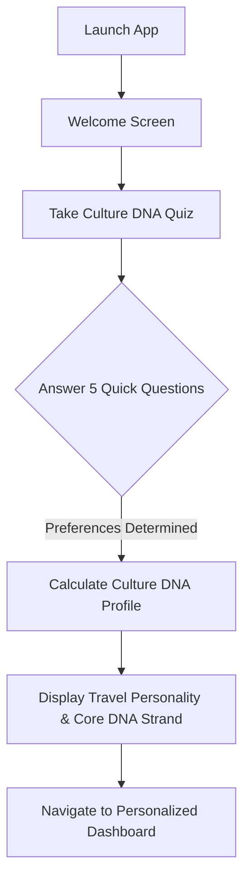
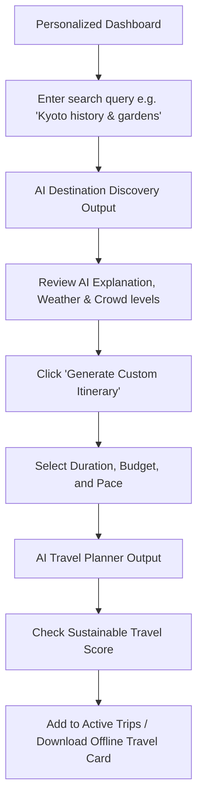
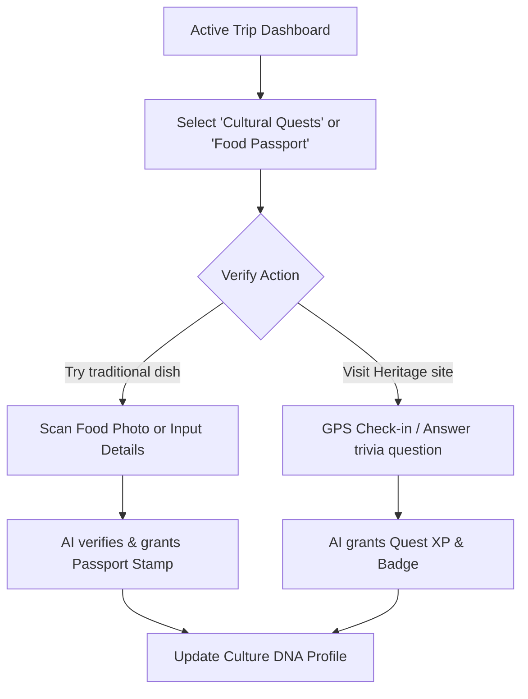
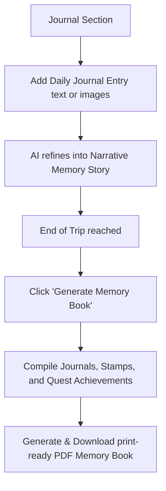

# User Experience (UX) Design - Culture Compass AI

This document establishes the user personas, key user flows, and the overall information architecture of the platform.

---

## 1. User Personas

### 1.1 Elena, The Heritage Explorer (42, High School History Teacher)
- **Motivations**: Deeply interested in local history, historical timelines, folklore, and UNESCO World Heritage sites.
- **Pain Points**: Most itineraries cover only superficial tourist spots without explaining the "why" or history behind them.
- **Preferred Features**: Time Machine Mode, AI Storytelling, Heritage Explorer, Talk to the Destination.
- **Tech Savviness**: Moderate; prefers straightforward navigation and clear reading screens.

### 1.2 Kenji, The Culinary Adventurer (29, Software Engineer & Food Blogger)
- **Motivations**: Seeking authentic local food, regional ingredients, food history, and cooking traditions. Avoids generic tourist traps.
- **Pain Points**: Difficult to find where locals actually eat or understand the cultural protocol for ordering food in other countries.
- **Preferred Features**: Food Explorer, AI Food Passport, AI Conversation Simulator.
- **Tech Savviness**: High; expects fast interactions and rich visuals.

### 1.3 Chloe, The Sustainable Nomad (31, Remote Freelancer & Climate Advocate)
- **Motivations**: Wants to travel ethically, support indigenous and local-owned businesses, and reduce carbon footprint.
- **Pain Points**: Itinerary planners default to car rentals and flights, omitting train routes or local walking opportunities. Lack of ethical verification.
- **Preferred Features**: Responsible Tourism, Sustainable Travel Score, Hidden Gems.
- **Tech Savviness**: High; uses mobile apps on-the-go.

---

## 2. User Flows

### 2.1 Onboarding & Culture DNA Discovery


### 2.2 Destination Discovery & Custom Itinerary Planning


### 2.3 Quest Gamification & Food Passport Stamps


### 2.4 Travel Journal & Memory Book Compilation


---

## 3. Information Architecture (IA)

```
Culture Compass AI (Root)
│
├── 📁 / (Root Layout)
│   ├── 📄 login (Clerk Login Page)
│   └── 📄 register (Clerk Registration Page)
│
├── 📁 dashboard (Personalized User Landing Page)
│   ├── 📄 page.tsx (Active Trips, Daily Quests Summary, personalized Recommendations)
│   │
│   ├── 📁 explore (Search & Discovery)
│   │   ├── 📄 page.tsx (Search input, dynamic map, crowd density cards)
│   │   └── 📄 [destinationId] (Deep dive into Hidden Gems, History, Customs)
│   │
│   ├── 📁 planner (Itinerary Builder)
│   │   └── 📄 page.tsx (Dynamic multi-day builder interface with Sustainability scores)
│   │
│   ├── 📁 quests (Gamified Hub)
│   │   ├── 📄 page.tsx (Quests log, XP progress, unlocked Badges)
│   │   └── 📄 food-passport (Cuisine stamps log and recipe cards)
│   │
│   ├── 📁 chat (AI Travel Chat & Talk to Destination)
│   │   └── 📄 page.tsx (Conversational assistant with destination persona selectors)
│   │
│   ├── 📁 journal (Travel Diary logs)
│   │   └── 📄 page.tsx (List of logs, narrative generator, PDF book compiler)
│   │
│   └── 📁 profile (Culture DNA)
│       └── 📄 page.tsx (Dynamic DNA visualization, quiz retraining, and settings)
│
└── 📁 offline (Offline Travel Card View)
    └── 📄 [tripId].tsx (High-contrast, download-friendly, basic offline summary)
```

### Key UI Layout Components:
- **Global Sidebar / Bottom Nav (Mobile)**: Glassmorphic sticky menu containing links to Dashboard, Explore, Planner, Quests, Journal, and Profile.
- **Theme Switcher**: Fluid transitions between light/dark modes using Tailwind state CSS.
- **Top Utility Header**: Shows active quest notification bell, Quick Emergency Guide button, and Clerk User Profile dropdown.
- **Accessibility Skip Link**: Positioned at the very top of each layout to enable screen reader users to skip navigation directly to the main content.
